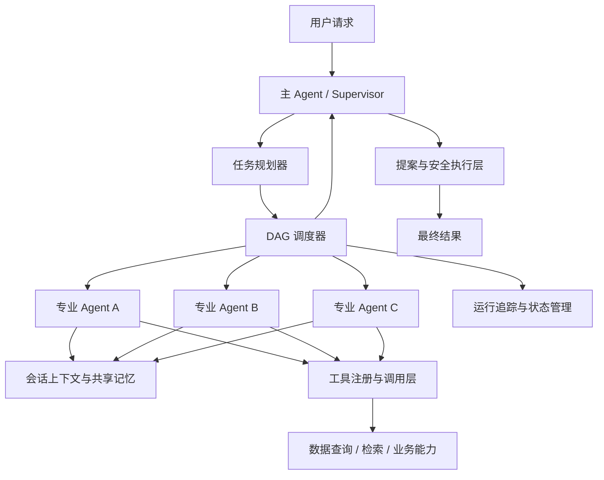

# 多 Agent 智能任务编排系统

> 一套面向复杂任务的可控、可扩展、可追溯多 Agent 系统。  
> 核心编排、上下文管理和安全执行机制均自主设计，而非简单封装通用 Agent 框架。

---

## 项目简介

传统 Agent 框架通常将任务规划、上下文、工具调用和执行状态隐藏在框架内部。随着任务复杂度上升，容易出现提示词膨胀、执行链路不透明、错误难定位、上下文重复传递等问题。

本项目采用 **主 Agent + 专业 Agent + 工具层** 的分层设计，将复杂请求拆分为可执行的任务图，并通过统一协议完成任务调度、上下文共享、工具调用、结果汇总和安全写入。

项目重点不是“接入多个大模型角色”，而是实现一套真正可运行的 **多 Agent 协作基础设施**。

---

## 核心亮点

### 1. 自主设计多 Agent 分层架构

- **主 Agent**：理解用户需求、拆解任务、调度执行并汇总结果。
- **专业 Agent**：处理特定类型的分析任务，保持职责单一。
- **工具层**：封装检索、数据查询和业务操作，避免 Agent 直接操作底层系统。

各层之间通过结构化协议通信，专业 Agent 可以独立开发、注册、替换和扩展。

### 2. 显式 DAG 任务编排

复杂请求会被拆解为带依赖关系的任务节点，并形成可观察的任务 DAG。

系统支持：

- 任务依赖管理
- 跨任务参数传递
- 无依赖任务并发执行
- 失败隔离与状态汇总
- 有限重试与重新规划

相比通用框架中的黑盒式执行链，本项目的任务流更加可控、可调试。

### 3. 按需上下文读取

系统不会将全部历史信息一次性塞入每个 Agent。

主 Agent 只传递完成任务所需的基础信息；专业 Agent 在发现信息不足时，可以通过统一接口申请补充上下文。若仍无法获得必要参数，则向主 Agent 返回结构化缺参结果，由主 Agent 统一与用户交互。

该机制能够：

- 减少重复上下文传递
- 降低 Token 消耗
- 避免无关信息干扰
- 明确区分“缺少用户参数”和“业务数据不存在”

### 4. 会话级共享记忆

系统为每次任务创建临时共享记忆空间，用于保存：

- 用户输入
- 任务规划结果
- Agent 中间结论
- 工具调用结果
- 上下文补充记录
- 最终输出

多个专业 Agent 可以按需读取同一份会话记忆，任务结束后自动清理，避免临时信息污染长期记忆。

### 5. 可追溯执行链路

系统记录从用户请求到最终结果的完整执行过程，包括：

- 任务拆解
- Agent 调用关系
- 上下文来源
- 工具输入与输出
- 节点执行状态
- 异常与重试信息
- 最终结果生成过程

相比只返回最终答案的通用 Agent，系统更便于问题定位、效果评估和后续优化。

### 6. 安全写操作机制

分析类 Agent 只负责生成建议或操作提案，不允许直接修改系统状态。

涉及写操作时，必须经过：

1. 参数校验
2. 操作提案生成
3. 用户确认
4. 执行前状态复校
5. 幂等提交
6. 审计记录

该设计将“大模型决策”与“系统执行”分离，降低误操作和重复提交风险。

---

## 相比通用 Agent 框架的优势

| 通用框架常见方式 | 本项目设计 |
|---|---|
| 执行流程由框架内部隐式控制 | 使用显式 DAG 管理任务依赖和执行状态 |
| 将大量上下文直接传给 Agent | 专业 Agent 按需申请上下文 |
| 多角色主要依赖提示词区分 | 通过职责、协议、工具和输入输出模型隔离 |
| 异常通常直接终止整个流程 | 支持节点级失败隔离和有限重规划 |
| 工具调用结果难以追踪 | 保存完整任务、上下文和工具调用链路 |
| Agent 可直接触发业务修改 | 写操作必须经过确认、复校和幂等提交 |
| 框架升级可能影响核心流程 | 核心编排逻辑自主可控，便于定制和扩展 |

---

## 系统架构



---

## 任务执行流程

```text
用户输入
  ↓
主 Agent 识别任务目标
  ↓
规划器拆解子任务并生成 DAG
  ↓
调度器根据依赖关系执行任务
  ↓
专业 Agent 按需读取上下文并调用工具
  ↓
中间结果写入会话共享记忆
  ↓
主 Agent 汇总多个专业 Agent 的结果
  ↓
生成最终回答或安全操作提案
```

---

## 技术栈

- **开发语言**：Python
- **大模型接入**：LLM API、Function Calling
- **数据建模与校验**：Pydantic、类型注解
- **并发调度**：Asyncio
- **检索增强**：RAG、BM25、Dense Retrieval、Reranking
- **状态与审计**：SQLite
- **展示层**：Streamlit
- **工程能力**：模块化工具注册、运行追踪、异常处理、幂等控制

---

## 核心模块

```text
agent/
├── supervisor/          # 主 Agent、任务理解与结果汇总
├── planner/             # 任务拆解与 DAG 生成
├── specialists/         # 专业 Agent
├── scheduler/           # 依赖调度与并发执行
├── context/             # 按需上下文读取
├── memory/              # 会话级共享记忆
├── protocols/           # Agent 间结构化通信协议
├── tools/               # 工具定义、注册与调用
├── tracing/             # 运行链路与状态追踪
├── approval/            # 人工确认与安全执行
└── schemas/             # Pydantic 输入输出模型
```

---

## 设计原则

- **职责单一**：主 Agent 负责调度，专业 Agent 负责分析，工具负责执行。
- **显式控制**：任务依赖、上下文来源和执行状态均可观察。
- **最小上下文**：只向 Agent 提供完成当前任务所需的信息。
- **读写分离**：分析结果不能直接转化为系统修改。
- **结构化通信**：避免 Agent 之间依赖不稳定的自然语言约定。
- **可替换扩展**：新增 Agent 或工具时不需要重写整体流程。
- **可追踪调试**：任何输出都可以追溯到任务节点和工具结果。

---


