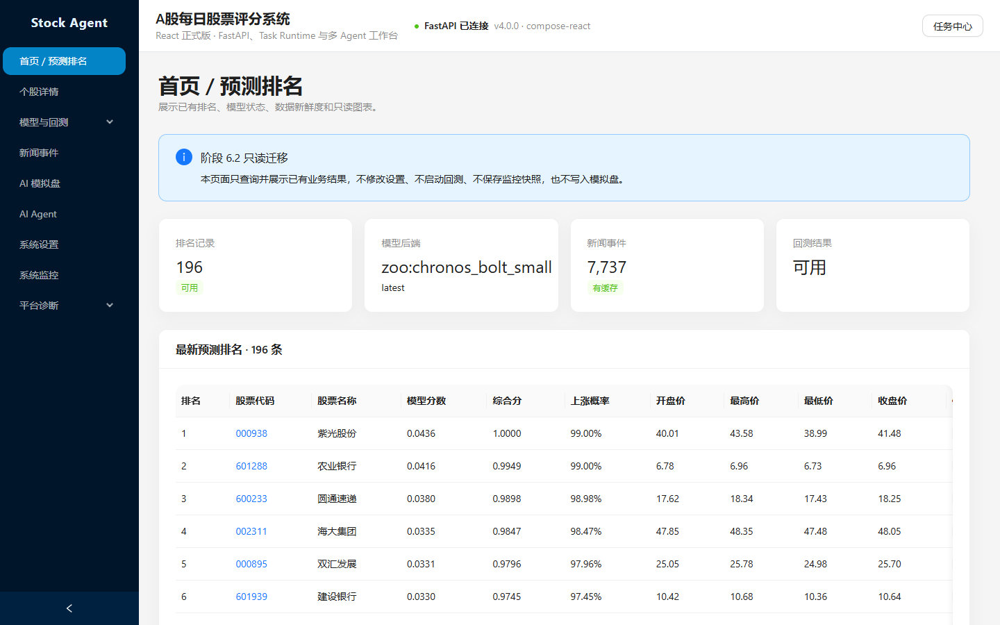
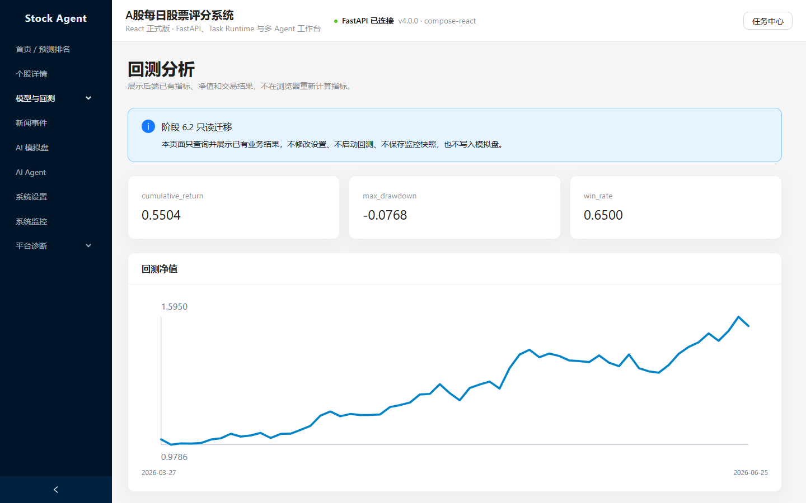
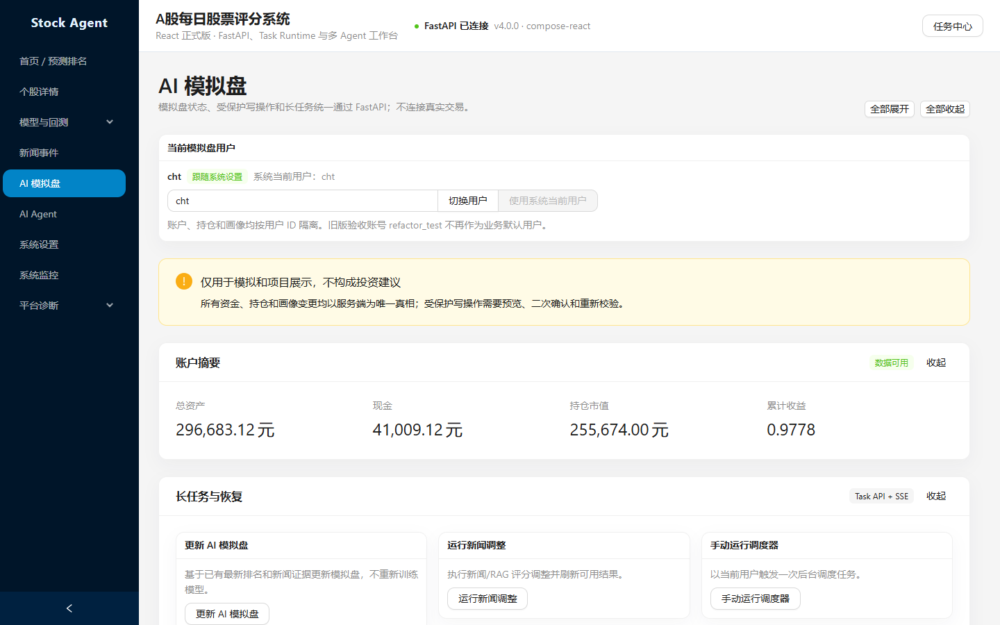
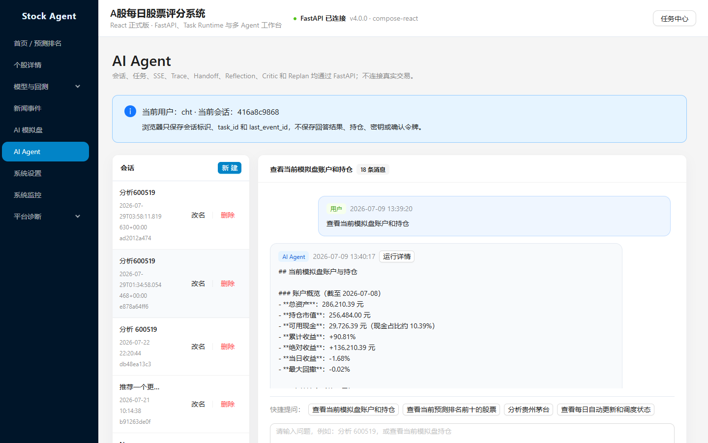
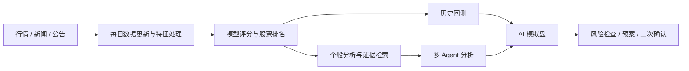
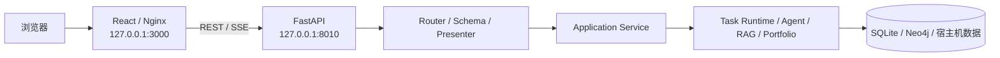

# A股每日股票评分系统

> 面向 A 股研究场景的多 Agent 智能分析、回测与模拟验证工作台


**本项目仅用于机器学习、金融数据分析和项目展示，不构成投资建议，不用于实盘交易。**

## 30 秒了解项目

这是一个把 **数据更新、模型评分、股票排名、新闻证据检索、历史回测、AI 模拟盘和多 Agent 协作** 串成完整流程的金融分析系统。

它不只展示模型结果，也解决 AI 应用落地中的工程问题：长任务如何恢复、多个 Agent 如何协作、回答如何关联证据、写操作如何二次确认、前后端如何安全隔离，以及系统如何部署和验收。

| 想解决的问题 | 系统提供的能力 |
| --- | --- |
| 每日从大量股票中快速发现值得进一步研究的标的 | 模型评分、综合排名、上涨概率和数据新鲜度展示 |
| 判断模型在历史数据上的表现 | 回测指标、净值曲线、交易与持仓明细 |
| 让 AI 回答具备可追溯依据 | 新闻、公告、研报的混合 RAG 检索与证据引用 |
| 验证组合策略但不触碰真实交易 | 用户隔离的 AI 模拟盘、持仓、资金和订单记录 |
| 让复杂分析任务可控、可恢复 | Main Agent、Worker Agent、Task DAG、SSE 和运行 Trace |
| 降低 AI 直接修改业务数据的风险 | 预览、二次确认、服务端复校和幂等提交 |

## 系统演示

### 预测排名工作台

首页聚合模型状态、新闻数据、回测可用性和最新股票评分，让使用者先看到“今天有什么结果”。

<p align="center">
  
</p>

### 从模型评估到 Agent 应用

<table>
  <tr>
    <td width="50%" valign="top">
      <strong>回测分析</strong><br>
      用历史指标、净值曲线和交易明细评估模型表现，不把历史结果当作未来收益承诺。<br><br>
      
    </td>
    <td width="50%" valign="top">
      <strong>AI 模拟盘</strong><br>
      展示账户、持仓和长任务入口；所有写操作都经过预览、确认和服务端复校。<br><br>
      
    </td>
  </tr>
  <tr>
    <td colspan="2" valign="top">
      <strong>AI Agent 工作台</strong><br>
      在会话中查询排名、持仓、风险和 RAG 证据，并查看任务、工具调用、Handoff、Reflection、Critic 与 Replan 运行信息。<br><br>
      
    </td>
  </tr>
</table>

> 截图来自当前 React 正式前端的实际运行页面。页面中的股票、概率、收益和回测数据仅用于功能演示与研究验证。

## 业务闭环


```mermaid
flowchart LR
    A["行情 / 新闻 / 公告"] --> B["每日数据更新与特征处理"]
    B --> C["模型评分与股票排名"]
    C --> D["个股分析与证据检索"]
    C --> E["历史回测"]
    D --> F["多 Agent 分析"]
    E --> G["AI 模拟盘"]
    F --> G
    G --> H["风险检查 / 预案 / 二次确认"]
```

系统覆盖的主要页面：

- **首页 / 预测排名**：最新评分、综合排名、上涨概率、模型状态与数据新鲜度；
- **个股详情**：行情快照、历史价格、风险与置信度、相关事件及证据检索；
- **模型与回测**：模型指标、模型搜索结果、净值曲线和交易明细；
- **新闻事件**：新闻、公告和研究资料的结构化查询；
- **AI 模拟盘**：账户、持仓、订单、资金流水、用户画像与受保护写操作；
- **AI Agent**：自然语言任务、会话历史、运行步骤、工具调用和证据来源；
- **系统监控**：Message Bus、Memory、ReAct、Reflection、Handoff 与告警；
- **平台诊断**：API 健康状态、部署模式和 Task Runtime 运行边界。

## 项目亮点

### 1. 自研多 Agent 协作与任务编排

- Main Agent 负责理解目标、拆解任务和生成 Task DAG；
- Worker Agent 按能力卡承接证据检索、组合分析、风险检查、图谱影响和报告生成等职责；
- Worker 只获取完成任务所需的最小上下文，避免无差别传递全部会话；
- 支持 Handoff、Reflection、Critic、有限 Replan 和结构化中间结果；
- Agent、Tool 和 Provider 保持分层，便于替换模型或扩展业务能力。

### 2. 可恢复的长任务运行时

- FastAPI 提供统一 Task API；
- SSE 实时推送任务状态与进度；
- 浏览器刷新后可通过 `task_id` 和 `last_event_id` 恢复；
- 支持任务取消、超时、失败隔离和状态持久化；
- `run_id`、`task_id`、`tool_call_id`、`session_id` 和 `trace_id` 串联运行链路。

### 3. 有证据的混合 RAG

检索链路组合了：

```text
查询标准化
  -> 元数据过滤
  -> BM25 稀疏召回 + Dense 向量召回
  -> RRF 融合
  -> Cross-Encoder 重排
  -> 证据片段与来源返回
```

RAG 只提供证据，不直接覆盖账户、持仓或其他业务事实。重要结论可以追溯到对应的数据、工具调用和来源片段。

### 4. 面向 AI 写操作的安全闭环

```text
Proposal -> Approval -> Revalidate -> Commit
```

- Agent 先生成结构化预案，不直接修改业务状态；
- 用户对资金、持仓和画像变更进行二次确认；
- 服务端提交前重新读取资金、持仓与上下文；
- 使用幂等键阻止重复提交；
- 确认令牌、API Key 和密码不进入 React、日志或 Git。

### 5. 清晰的前后端与数据边界

- React 只调用 `/api/v1/**`；
- Nginx 提供 SPA 路由和同源 API / SSE 代理；
- FastAPI Router、Schema 和 Presenter 负责传输层；
- Application Service 负责用例编排；
- 浏览器不读取数据库、文件、模型或服务端密钥；
- SQLite 负责应用运行和业务事务，Neo4j 负责金融实体与关系语义。

## 正式运行架构

Stage 6.5 的生产入口只有 React 前端和 FastAPI API：


```mermaid
flowchart LR
    A["浏览器"] --> B["React / Nginx<br/>127.0.0.1:3000"]
    B -->|REST / SSE| C["FastAPI<br/>127.0.0.1:8010"]
    C --> D["Router / Schema / Presenter"]
    D --> E["Application Service"]
    E --> F["Task Runtime / Agent / RAG / Portfolio"]
    F --> G[("SQLite / Neo4j / 宿主机数据")]
```

旧 Streamlit、`app.py`、`app/**` 和旧 `client/api/**` 已下线，不再作为正式入口。

## 技术栈

| 层级 | 主要技术 |
| --- | --- |
| 前端 | React 19、TypeScript 5.9、Vite 8、Ant Design 6、TanStack Query、Zustand、Axios |
| API 与应用层 | Python 3.12、FastAPI、Uvicorn、Pydantic、Asyncio、APScheduler |
| Agent | Main / Worker Agent、Task DAG、Tool Registry、Working Memory、Handoff、Reflection、Critic、Replan |
| 模型与数据 | Chronos Forecasting、LightGBM、scikit-learn、Transformers、pandas、NumPy |
| RAG 与知识层 | BM25、Dense Retrieval、RRF、Cross-Encoder、Sentence-Transformers、Neo4j |
| 存储 | SQLite、宿主机数据目录、模型与索引文件 |
| 工程化 | Docker、Docker Compose、Nginx、OpenAPI、Pytest、Vitest、Playwright、结构化日志 |

## 代码结构

```text
stock_daily_app/
├─ frontend/              # React 正式前端、API Client 与 Nginx 配置
├─ server/api/            # FastAPI 路由、DTO、Presenter 与合同
├─ server/task_runtime/   # 长任务状态、持久化、Worker 与 SSE
├─ application/           # 应用服务与 UI 无关的 support helper
├─ agent/                 # Main/Worker Agent、DAG、工具与安全写链路
├─ portfolio/             # 模拟盘、组合、资金与风险逻辑
├─ rag/                   # 混合检索、融合、重排与索引
├─ pipelines/             # 每日更新、预测、评分与模拟盘流程
├─ database/              # SQLite Repository 与迁移
├─ contracts/stage6/      # 冻结的 HTTP、Task、SSE 和写操作合同
├─ scripts/docker/        # 正式启动与端到端验收
├─ scripts/refactor/      # 架构、合同与浏览器检查
├─ tests/                 # 后端、API、运行时和前端测试
├─ docker-compose.yml
└─ Dockerfile.compose
```

`data/`、`models/`、`outputs/`、`logs/`、`runtime/`、`external_repos/` 和 `local_app_config.json` 属于宿主机运行数据，不应复制进镜像、交付包或 Git。

## 快速启动

### 环境要求

- Windows 10 / 11；
- Docker Desktop 与 Docker Compose；
- 项目目录：`D:\stock_daily_app`；
- 项目 Python：`D:\stock_daily_app\.venv\Scripts\python.exe`；
- 本地已准备运行配置、数据、模型或索引。

### 启动正式服务

在项目目录执行：

```powershell
powershell -ExecutionPolicy Bypass -File .\scripts\docker\start_compose.ps1
```

也可以使用安装在 `D:\google` 的一键脚本：

```text
D:\google\D_google_stage_06_5_build_and_start.bat
```

启动完成后访问：

| 服务 | 地址 |
| --- | --- |
| React / Nginx | http://127.0.0.1:3000 |
| FastAPI | http://127.0.0.1:8010 |
| OpenAPI（启用时） | http://127.0.0.1:8010/docs |

## 验收与质量保障

完整 Stage 6.5 验收：

```text
D:\google\D_google_test_stage_06_5.bat
```

仓库内脚本：

```powershell
powershell -ExecutionPolicy Bypass -File .\scripts\docker\test_stage6_5.ps1
```

验收范围包括：

- Stage 6 合同和 6.1～6.5 架构检查；
- FastAPI、Application Service 与核心领域单测；
- Task Runtime、SSE、取消与刷新恢复；
- React 路由、同源 API 和受保护写操作；
- 真实 Chrome 端到端检查；
- 敏感信息、旧 Streamlit 入口和浏览器越界访问检查。

执行 Python 测试或维护脚本时，必须使用项目虚拟环境：

```powershell
.\.venv\Scripts\python.exe -m pytest tests -q
```

## 面试介绍参考

> 这是一个面向 A 股研究场景的多 Agent 智能分析系统。我把每日数据更新、模型评分、股票排名、新闻 RAG、历史回测和 AI 模拟盘整合到同一套 React + FastAPI 工作台中。复杂请求会被拆成显式 Task DAG，由 Main Agent 按能力分派给不同 Worker；长任务通过 Task API 和 SSE 实现进度推送、取消与刷新恢复。系统还为 AI 写操作设计了“预案、确认、复校、提交”的安全闭环，并通过 Docker Compose、合同检查、单元测试和真实浏览器验收保证交付质量。

## 免责声明

**本项目仅用于机器学习、金融数据分析和项目展示，不构成投资建议，不用于实盘交易。**

- 模型评分、上涨概率和 AI 生成内容不代表未来表现；
- 历史回测和模拟盘结果不代表真实收益；
- 系统不连接真实证券交易接口；
- 使用者应独立判断数据、模型和生成内容的适用性。
