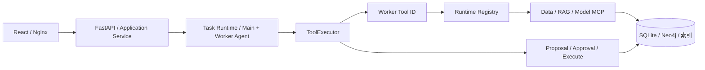
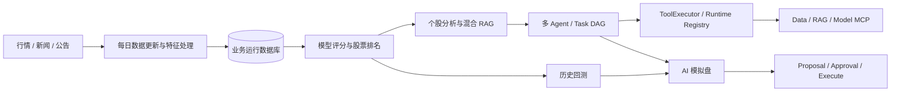
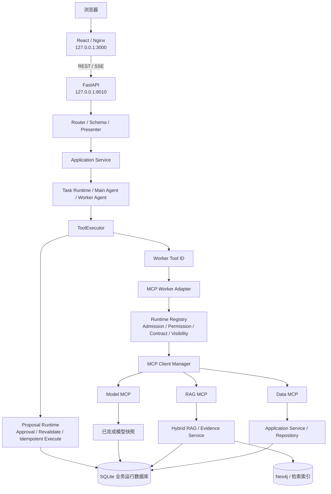

# Stock Agent Platform｜A股多 Agent 金融分析工作台

> 面向 A 股研究场景的多 Agent 智能分析、回测、模拟盘与可控工具运行时


[](https://github.com/lxh-boop/stock-agent-platform/actions/workflows/core-tests.yml)

**本项目仅用于机器学习、金融数据分析和项目展示，不构成投资建议，不用于实盘交易。**

## 64 秒项目演示

<p align="center">
  <a href="docs/demo/stock-agent-platform-64s-demo.mp4">
    
  </a>
</p>

<p align="center">
  <a href="docs/demo/stock-agent-platform-64s-demo.mp4"><strong>▶ 点击播放 64 秒演示视频</strong></a>
  · 本地演示地址：<a href="http://127.0.0.1:3000">http://127.0.0.1:3000</a>
</p>

> 视频由当前 React 正式前端的四张真实页面截图生成，无音频；股票、概率、收益和回测数据仅用于功能演示与研究验证。当前没有公网部署地址。

## 系统架构一览


```mermaid
flowchart LR
    A["React / Nginx"] --> B["FastAPI / Application Service"]
    B --> C["Task Runtime / Main + Worker Agent"]
    C --> D["ToolExecutor"]
    D --> E["Worker Tool ID"]
    E --> F["Runtime Registry"]
    F --> G["Data / RAG / Model MCP"]
    G --> H[("SQLite / Neo4j / 索引")]
    D --> I["Proposal / Approval / Execute"]
    I --> H
```

## 30 秒了解项目

这是一个把 **数据更新、模型评分、股票排名、新闻证据检索、历史回测、AI 模拟盘、多 Agent 协作和内部 MCP 能力调用** 串成完整流程的金融分析系统。

它不只展示模型结果，也解决 AI 应用落地中的工程问题：长任务如何恢复、多个 Agent 如何协作、回答如何关联证据、工具如何准入、Worker 间数据语义如何版本化、写操作如何二次确认、前后端如何安全隔离，以及系统如何部署和验收。

| 想解决的问题 | 系统提供的能力 |
| --- | --- |
| 每日从大量股票中快速发现值得进一步研究的标的 | 模型评分、综合排名、上涨概率和数据新鲜度展示 |
| 判断模型在历史数据上的表现 | 回测指标、净值曲线、交易与持仓明细 |
| 让 AI 回答具备可追溯依据 | 新闻、公告、研报的混合 RAG 检索与证据引用 |
| 验证组合策略但不触碰真实交易 | 用户隔离的 AI 模拟盘、持仓、资金和订单记录 |
| 让复杂分析任务可控、可恢复 | Main Agent、Worker Agent、Task DAG、SSE 和运行 Trace |
| 安全接入内部数据、检索和模型能力 | MCP Discovery、Runtime Admission、Worker Tool 投影和 ToolExecutor 控制面 |
| 降低 AI 直接修改业务数据的风险 | Proposal、Approval、服务端复校、幂等执行和审计 |

## 系统演示

### 预测排名工作台

首页聚合模型状态、新闻数据、回测可用性和最新股票评分，让使用者先看到“今天有什么结果”。

<p align="center">
  
</p>

### 从模型评估到 Agent 应用

<table>
  <tr>
    <td width="50%" valign="top">
      <strong>回测分析</strong><br>
      用历史指标、净值曲线和交易明细评估模型表现，不把历史结果当作未来收益承诺。<br><br>
      
    </td>
    <td width="50%" valign="top">
      <strong>AI 模拟盘</strong><br>
      展示账户、持仓和长任务入口；所有写操作都经过预览、确认和服务端复校。<br><br>
      
    </td>
  </tr>
  <tr>
    <td colspan="2" valign="top">
      <strong>AI Agent 工作台</strong><br>
      在会话中查询排名、持仓、风险和 RAG 证据，并查看任务、工具调用、Handoff、Reflection、Critic 与 Replan 运行信息。<br><br>
      
    </td>
  </tr>
</table>

> 截图来自当前 React 正式前端的实际运行页面。页面中的股票、概率、收益和回测数据仅用于功能演示与研究验证。

## 业务闭环


```mermaid
flowchart LR
    A["行情 / 新闻 / 公告"] --> B["每日数据更新与特征处理"]
    B --> C[("业务运行数据库")]
    C --> D["模型评分与股票排名"]
    D --> E["个股分析与混合 RAG"]
    D --> F["历史回测"]
    E --> G["多 Agent / Task DAG"]
    G --> H["ToolExecutor / Runtime Registry"]
    H --> I["Data / RAG / Model MCP"]
    F --> J["AI 模拟盘"]
    G --> J
    J --> K["Proposal / Approval / Execute"]
```

系统覆盖的主要页面：

- **首页 / 预测排名**：最新评分、综合排名、上涨概率、模型状态与数据新鲜度；
- **个股详情**：行情快照、历史价格、风险与置信度、相关事件及证据检索；
- **模型与回测**：模型指标、模型搜索结果、净值曲线和交易明细；
- **新闻事件**：新闻、公告和研究资料的结构化查询；
- **AI 模拟盘**：账户、持仓、订单、资金流水、用户画像与受保护写操作；
- **AI Agent**：自然语言任务、会话历史、运行步骤、工具调用和证据来源；
- **系统监控**：Message Bus、Memory、ReAct、Reflection、Handoff 与告警；
- **平台诊断**：API 健康状态、部署模式和 Task Runtime 运行边界。

## 项目亮点

### 1. 自研多 Agent 协作与任务编排

- Main Agent 负责理解目标、拆解任务和生成 Task DAG；
- Worker Agent 按能力卡承接证据检索、组合分析、风险检查、图谱影响和报告生成等职责；
- Worker 只获取完成任务所需的最小上下文，避免无差别传递全部会话；
- 支持 Handoff、Reflection、Critic、有限 Replan 和结构化中间结果；
- Agent、Tool 和 Provider 保持分层，便于替换模型或扩展业务能力。

### 2. 可恢复的长任务运行时

- FastAPI 提供统一 Task API；
- SSE 实时推送任务状态与进度；
- 浏览器刷新后可通过 `task_id` 和 `last_event_id` 恢复；
- 支持任务取消、超时、失败隔离和状态持久化；
- `run_id`、`task_id`、`tool_call_id`、`session_id` 和 `trace_id` 串联运行链路。

### 3. Runtime Registry 控制的内部 MCP

项目使用官方 Python MCP SDK 和 stdio transport 暴露三类内部只读能力：

| MCP Server | 职责 | 当前实现边界 |
| --- | --- | --- |
| Data MCP | 用户资料、组合、持仓、订单、股票、排名和推荐 | 只通过 Application Service / Repository 读取权威数据库 |
| RAG MCP | 文档搜索、新闻搜索和组合证据检索 | 复用现有 BM25 + Dense + RRF + Reranker，不新增向量数据库 |
| Model MCP | 个股评分、排名和风险结果 | 只读取 Task Runtime 已完成的 Kronos 推理快照，不在同步调用中执行长推理 |

MCP Discovery 只负责发现 Server 声明的能力，不自动注册、不自动赋权，也不直接暴露给 LLM。新能力必须依次经过：

```text
Discovered -> Admitted -> Registered -> Projected
```

- Runtime Registry 是 Tool Admission、权限、可见性和 Worker 投影的最终权威；
- 原始 `mcp.*` Tool 注册为 `system_private`，LLM 默认只看到稳定的 Worker Tool ID；
- 调用必须精确匹配已登记的 Worker Tool ID 和 Agent Role，不根据工具名称前缀放行；
- ToolExecutor 继续负责权限、参数、重试、熔断、超时、审计和 Artifact；
- 当前三个内部 Server 共发现 13 个 Tool，其中 6 个底层能力完成准入并投影为 7 个 Worker Tool ID；
- 外部 MCP 只保留默认禁用的扩展配置，当前不连接真实第三方 Server。

最小可运行集成使用正式排名工具，而不是额外维护示例 Server：

```text
Planner / LLM
  -> internal.ranking.get_latest
  -> ToolExecutor
  -> MCP Worker Adapter
  -> Runtime Registry Authorization
  -> mcp.model.predict_rank
  -> Model MCP Server
  -> PredictionRepository
```

可以使用项目虚拟环境直接验证 Discovery、Schema、Admission、Worker 投影和真实 stdio 调用：

```powershell
.\.venv\Scripts\python.exe -m pytest tests\unit\test_internal_mcp_stdio_phase234.py -q
```

### 4. 统一的 Tool 与 Artifact Contract

MCP Schema 和业务合同承担不同职责：

```text
MCP inputSchema / outputSchema：校验调用与返回的结构
ToolInputContract / ToolOutputContract：定义业务语义、版本和 DAG 兼容性
```

- 沿用并扩展现有 Tool Contract，没有新增平行的 Artifact Contract 系统；
- Task DAG 同时检查 `schema_id`、`contract` 和 `version / accepted_versions`；
- Artifact 必须携带 `contract`、`version`、`schema_id` 和 `provenance`；
- 一个工具产生多个语义 Slot 时，Artifact 保存完整 `contracts` 映射；
- ContextBundle v2 在 Worker 间传递值的同时传递合同、版本、模式标识和来源，不再只靠字段名称约定。

### 5. 有证据的混合 RAG

检索链路组合了：

```text
查询标准化
  -> 元数据过滤
  -> BM25 稀疏召回 + Dense 向量召回
  -> RRF 融合
  -> Cross-Encoder 重排
  -> 证据片段与来源返回
```

RAG 只提供证据，不直接覆盖账户、持仓或其他业务事实。重要结论可以追溯到对应的数据、工具调用和来源片段。

### 6. 面向 AI 写操作的统一安全闭环

```text
生成 Proposal
  -> 用户 Approval / Reject
  -> 服务端复校所有者、会话、版本、Payload Hash、状态和有效期
  -> 幂等 Execute
  -> 审计结果
```

- Agent 先创建结构化 Proposal，不直接修改正式业务状态；
- Proposal 保存不可变版本快照、Payload Hash、所有者、状态和有效期；
- 浏览器只提交 `proposal_id`、`request_id`、幂等键和用户明确输入的确认文本；
- 服务端执行前重新读取 Proposal、资金、持仓和约束并完成复校；
- 相同幂等键返回既有结果，不重复产生业务写入；
- 组合写入和业务图写入统一进入同一条 Proposal Runtime，不保留第二套真实执行逻辑；
- API Key、密码和其他敏感信息不进入 React、日志或 Git。

### 7. 数据库权威与清晰的系统边界

- 用户资料、组合、持仓、订单、正式预测、排名、推荐、风险和 Runtime 状态以数据库为权威来源；
- 数据库为空时返回明确空结果，数据库异常时明确失败，生产运行不静默回退 CSV；
- 训练数据、模型文件、检索缓存、回测结果和离线分析产物继续保留为宿主机文件；
- React 只调用 `/api/v1/**`；
- Nginx 提供 SPA 路由和同源 API / SSE 代理；
- FastAPI Router、Schema 和 Presenter 负责传输层；
- Application Service 负责用例编排；
- 浏览器不读取数据库、文件、模型或服务端密钥；
- SQLite 负责应用运行数据和业务事务，Neo4j 负责金融实体与关系语义。

## 正式运行架构

Stage 6.5 的生产入口只有 React 前端和 FastAPI API：


```mermaid
flowchart TB
    A["浏览器"] --> B["React / Nginx<br/>127.0.0.1:3000"]
    B -->|REST / SSE| C["FastAPI<br/>127.0.0.1:8010"]
    C --> D["Router / Schema / Presenter"]
    D --> E["Application Service"]
    E --> F["Task Runtime / Main Agent / Worker Agent"]
    F --> G["ToolExecutor"]
    G --> H["Worker Tool ID"]
    H --> I["MCP Worker Adapter"]
    I --> J["Runtime Registry<br/>Admission / Permission / Contract / Visibility"]
    J --> K["MCP Client Manager"]
    K --> L["Data MCP"]
    K --> M["RAG MCP"]
    K --> N["Model MCP"]
    L --> O["Application Service / Repository"]
    M --> P["Hybrid RAG / Evidence Service"]
    N --> Q["已完成模型快照"]
    O --> R[("SQLite 业务运行数据库")]
    P --> R
    P --> S[("Neo4j / 检索索引")]
    Q --> R
    G --> T["Proposal Runtime<br/>Approval / Revalidate / Idempotent Execute"]
    T --> R
```

旧 Streamlit、`app.py`、`app/**` 和旧 `client/api/**` 已下线，不再作为正式入口。

这里的三个 MCP Server 是内部 stdio 进程边界，不是三个必须独立部署的网络微服务。长模型任务仍由 Task Runtime 异步执行，MCP 只读取已经完成并进入数据库的结果。

## 技术栈

| 层级 | 主要技术 |
| --- | --- |
| 前端 | React 19、TypeScript 5.9、Vite 8、Ant Design 6、TanStack Query、Zustand、Axios |
| API 与应用层 | Python 3.12、FastAPI、Uvicorn、Pydantic、Asyncio、APScheduler |
| Agent Runtime | Main / Worker Agent、Task DAG、ToolExecutor、Tool Registry、ContextBundle、Handoff、Reflection、Critic、Replan |
| MCP 与合同 | 官方 Python MCP SDK、stdio、Runtime Registry、JSON Schema、ToolInputContract / ToolOutputContract、Artifact Provenance |
| 模型与数据 | Kronos / Chronos Forecasting、LightGBM、scikit-learn、Transformers、pandas、NumPy |
| RAG 与知识层 | BM25、Dense Retrieval、RRF、Cross-Encoder、Sentence-Transformers、Neo4j |
| 存储 | SQLite 业务运行数据库、Neo4j、宿主机训练数据、模型、索引和离线产物 |
| 工程化 | Docker、Docker Compose、Nginx、OpenAPI、Pytest、Vitest、Playwright、结构化日志 |

## 代码结构

```text
stock_daily_app/
├─ frontend/              # React 正式前端、API Client 与 Nginx 配置
├─ server/api/            # FastAPI 路由、DTO、Presenter 与合同
├─ server/task_runtime/   # 长任务状态、持久化、Worker 与 SSE
├─ application/           # 应用服务与 UI 无关的 support helper
├─ agent/                 # Main/Worker Agent、DAG、工具与安全写链路
│  ├─ mcp/                # Discovery、Runtime Registry、stdio Client/Server 与 Worker Adapter
│  ├─ tool_runtime/       # Tool Contract、Registry、校验与 ToolExecutor
│  ├─ worker_tools/       # LLM 可见的稳定 Worker Tool 投影
│  ├─ proposals/          # Proposal 状态机、版本、幂等请求与数据库存储
│  └─ context/            # ContextBundle 与 Worker 间业务语义传递
├─ portfolio/             # 模拟盘、组合、资金与风险逻辑
├─ rag/                   # 混合检索、融合、重排与索引
├─ pipelines/             # 每日更新、预测、评分与模拟盘流程
├─ database/              # SQLite Repository、Migration 与运行数据导入
│  ├─ migrations/         # Proposal 与业务运行数据表迁移
│  └─ repositories/       # 数据库权威访问层
├─ contracts/stage6/      # 冻结的 HTTP、Task、SSE 和写操作合同
├─ scripts/docker/        # 正式启动与端到端验收
├─ scripts/migrations/    # 运行数据一次性导入与审计工具
├─ scripts/refactor/      # 架构、合同与真实浏览器检查
├─ tests/                 # 后端、API、运行时和前端测试
├─ docker-compose.yml
└─ Dockerfile.compose
```

`data/`、`models/`、`outputs/`、`logs/`、`runtime/`、`external_repos/` 和 `local_app_config.json` 属于宿主机运行数据或敏感配置，不应复制进镜像、交付包或 Git。生产 Compose 通过挂载使用这些内容。

## 快速启动

### 环境要求

- Windows 10 / 11；
- Docker Desktop 与 Docker Compose；
- 项目目录：`D:\stock_daily_app`；
- 项目 Python：`D:\stock_daily_app\.venv\Scripts\python.exe`；
- 本地已准备运行配置、数据、模型或索引；
- 只有在脱离 Docker 维护前端时才需要 Node.js 22.12 或更高版本。

### 配置准备

- `local_app_config.json` 必须由运行环境在项目根目录提供；启动脚本不会创建或覆盖这个敏感文件；
- 不要把 Token、API Key、密码或真实确认信息提交到 Git；
- 如需覆盖端口、并发数、宿主机服务地址或模型路径，可参考 [`compose.env.example`](compose.env.example) 配置本地 `.env`；
- Data、RAG、Model MCP Server 由 Runtime 使用项目当前 Python 解释器按需启动，不需要手工启动三个额外网络服务。

### 启动正式服务

在项目目录执行：

```powershell
powershell -ExecutionPolicy Bypass -File .\scripts\docker\start_compose.ps1
```

已有镜像且不希望重新构建时，可以使用：

```powershell
powershell -ExecutionPolicy Bypass -File .\scripts\docker\start_compose.ps1 -NoBuild
```

也可以使用安装在 `D:\google` 的一键脚本：

```text
D:\google\D_google_stage_06_5_build_and_start.bat
```

启动完成后访问：

| 服务 | 地址 |
| --- | --- |
| React / Nginx | http://127.0.0.1:3000 |
| FastAPI | http://127.0.0.1:8010 |
| OpenAPI（启用时） | http://127.0.0.1:8010/docs |

正式 Compose 只允许 `api` 和 `frontend` 两个服务。浏览器通过 Nginx 同源访问 API 和 SSE，不直接连接 MCP Server、数据库、文件系统、模型或密钥。

## 验收与质量保障

完整 Stage 6.5 验收：

```text
D:\google\D_google_test_stage_06_5.bat
```

仓库内脚本：

```powershell
powershell -ExecutionPolicy Bypass -File .\scripts\docker\test_stage6_5.ps1
```

验收范围包括：

- Stage 6 合同和 6.1～6.5 架构检查；
- FastAPI、Application Service 与核心领域单测；
- Task Runtime、SSE、取消与刷新恢复；
- React 路由、同源 API 和受保护写操作；
- 真实 Chrome 端到端检查；
- 敏感信息、旧 Streamlit 入口和浏览器越界访问检查。

### GitHub Actions

仓库通过 [核心质量检查](https://github.com/lxh-boop/stock-agent-platform/actions/workflows/core-tests.yml) 工作流在推送到 `main` 或提交 Pull Request 时自动执行：

- 后端 Python 3.12 编译检查；
- Stage 6.0～6.5 合同与架构检查；
- Proposal、数据库权威、内部 MCP、Tool / Artifact Contract、ContextBundle、Worker / DAG / Handoff 和 Task Runtime 等 132 项核心回归测试；
- React / TypeScript 类型检查、Vitest 单测和 Vite 生产构建。

工作流不连接真实交易接口或外部 MCP Server，内部 MCP 测试通过本仓库的 stdio Server 完成。

执行 Python 测试或维护脚本时，必须使用项目虚拟环境：

```powershell
.\.venv\Scripts\python.exe -m pytest tests -q
```

## 面试介绍参考

> 这是一个面向 A 股研究场景的多 Agent 智能分析系统。我把每日数据更新、模型评分、股票排名、新闻 RAG、历史回测和 AI 模拟盘整合到同一套 React + FastAPI 工作台中。复杂请求会被拆成显式 Task DAG，由 Main Agent 按能力分派给不同 Worker；长任务通过 Task API 和 SSE 实现进度推送、取消与刷新恢复。底层数据、检索和模型能力通过内部 MCP 接入，但 Runtime Registry 仍然掌握准入、权限、可见性和 Worker Tool 投影；Tool Contract 和 Artifact Provenance 保证 Worker 间数据语义可验证。业务运行数据以数据库为权威，所有正式写操作进入 Proposal、Approval、服务端复校和幂等执行闭环。项目通过 Docker Compose、GitHub Actions、合同检查、单元测试和真实浏览器验收保证交付质量。

## 免责声明

**本项目仅用于机器学习、金融数据分析和项目展示，不构成投资建议，不用于实盘交易。**

- 模型评分、上涨概率和 AI 生成内容不代表未来表现；
- 历史回测和模拟盘结果不代表真实收益；
- 系统不连接真实证券交易接口；
- 使用者应独立判断数据、模型和生成内容的适用性。
